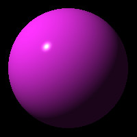
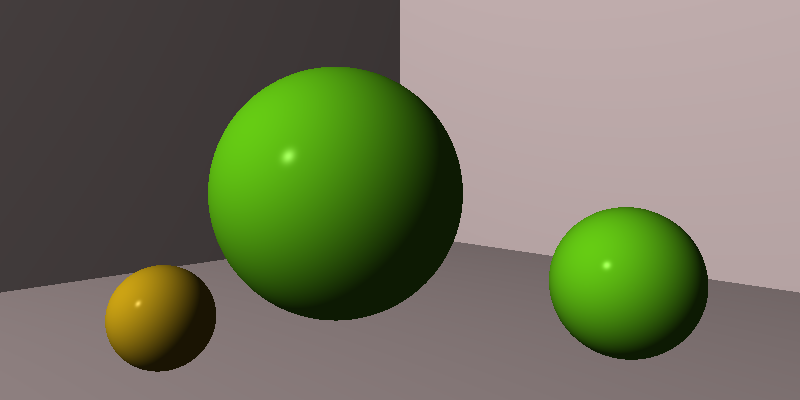
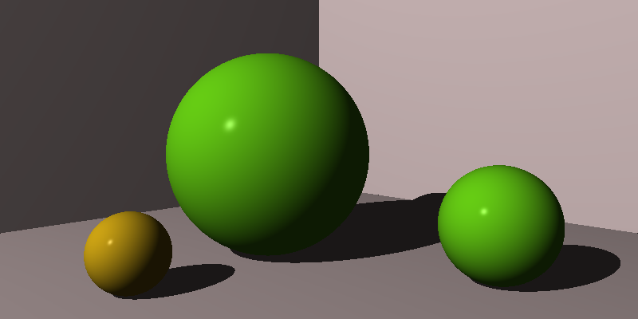

# RayTracerChallenge

Test driven implementation of a basic ray tracer as described in the book 'The Ray Tracer Challenge - A Test-Driven Guide to Your First 3D Renderer' by Jamis Buck.

## Goals
- Exemplify the usage of ceps in connection with modern C++. 
- Fun.
## Status
- chapter 1: :heavy_check_mark:
- chapter 2: :heavy_check_mark:
- chapter 3: :heavy_check_mark:
- chapter 4: :heavy_check_mark:
- chapter 5: :heavy_check_mark:
- chapter 6: :heavy_check_mark:
- chapter 7: :heavy_check_mark:
- chapter 8: :heavy_check_mark:
- chapter 9: pending
- chapter 10: pending
- chapter 11: pending
- chapter 12: pending
- chapter 13: pending
- chapter 14: pending
- chapter 15: pending
- chapter 16: pending
- chapter 17: pending
## Installation
### Requirements
- Unixish OS
- recent C++ compiler (e.g. g++ version >= 9)
- cmake
- https://github.com/cepsdev/machines4ceps
### Build
- ./rebuild.sh 
### Run the Gherkin Tests
- ./run-test features/NAME_OF_FEATURE_TEST
### Some Pictures
#### Chapter 6

#### Chapter 7 - Putting it Together

#### Chapter 8 - Shadows

